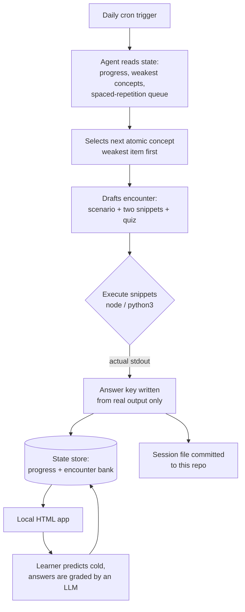

# Code Reading Quest

**Predict the output before you run it.** A daily code-reading discipline with spaced repetition and verified outputs, run by an autonomous agent — 60+ sessions and counting, the ten most recent published here.

Every snippet in this repo was run through a real interpreter (`node` / `python3`) **before** the answer key was written down. No guessed outputs. That constraint is enforced by the pipeline, not by discipline: the agent that writes a session cannot produce the `Verified` block without executing the code first.

## Motivation

I build and operate production systems for my own companies in Iceland (a 13-stage quote-to-order pipeline, a freight marketplace, a multi-market pricing SaaS) — most of it shipped with heavy AI assistance. That workflow has one bottleneck: **you can only trust AI-written code as far as you can read it.**

I tried passive tutorials; they didn't stick. What stuck was the loop borrowed from learning science: recall from memory, predict the output cold, verify against a real run, quiz without hints, bank a spaced-repetition card. This repo is the public trail of that loop — one session per day.

## Quick Start

1. Open any file in [`sessions/`](sessions/).
2. Read the snippet. **Write down your predicted output before scrolling further.**
3. Compare with the `verified` block (actual interpreter output).
4. Wrong? Good — that gap is the lesson.

## Usage

Each session file contains:

- **Concept** — one atomic idea (e.g. shallow copy via spread sharing nested references)
- **Encounter** — two related snippets wrapped in a scenario, with a question in one of six rotating formats (predict-output, bug-hunt, what-if, order-of-execution, ranking, reverse)
- **Verified output** — exact interpreter output, run before publishing
- **Quiz** — three no-hint questions with keys
- **Card** — the spaced-repetition card banked from the session (SM-2 scheduling)

## How it works

Nobody writes these sessions by hand. A scheduled agent runs every morning, unattended, and the interesting part is not the lessons — it is that the pipeline refuses to publish anything it has not executed.

Design decisions worth naming:

- **Verification is a gate, not a step.** The answer key is generated *from* captured stdout. A wrong prediction by the agent becomes a failed run, not a wrong lesson published to the internet.
- **The agent feeds; it never scores.** Writing the lesson and grading the answer are separate processes with separate write permissions. The agent that authors a session cannot award progress for it — that removes the obvious way for the system to flatter itself.
- **State lives in plain Markdown**, updated through anchored marker blocks and surgical edits rather than file rewrites. That decision came from an incident: an early run used a whole-file rewrite and destroyed months of archived sessions. Append-and-anchor is now a hard rule, with a backup taken before every structured write.
- **Free-text answers are graded by an LLM** against a stored key, and the result is written back to the state store idempotently — one scored session per day, re-runs are no-ops.
- **Content is banked, not consumed.** Every session is also stored as a structured record with its verified output, so a lesson can be re-served weeks later. A weekly cycle re-executes the oldest records and corrects any whose stored output no longer matches reality.

The state store and review cycles live in a private vault; this repo is the daily public artifact.

## Contributing

This is a personal practice log, so PRs aren't expected — but the format is free to steal. Fork it, delete `sessions/`, and start your own chain. The only rule that matters: **never look at the output before you've committed to a prediction.**
